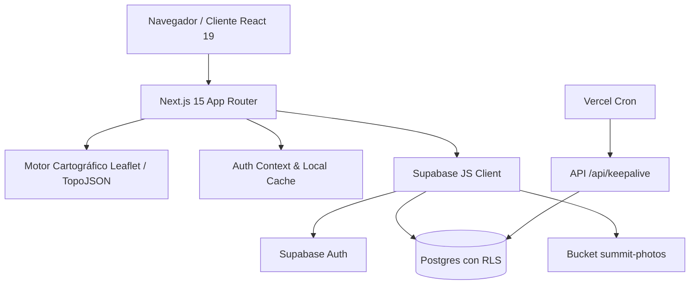

# Arquitectura del Sistema · 47 Picos & 196 Países

> Documento de referencia arquitectónica para desarrolladores y agentes de IA.  
> Cargar bajo demanda cuando la tarea requiera comprender flujos entre capas o dependencias globales.

---

## 1. Visión General del Sistema

La aplicación es una plataforma web para montañeros y viajeros que combina cartografía interactiva, seguimiento de retos geográficos, redes sociales y galerías multimedia.

---

## 2. Capas de la Aplicación

### 2.1 Presentación y Enrutamiento (`app/` y `components/`)
- **Next.js 15 App Router**:
  - `/` (Home): Dashboard principal y tracker de ascensiones ([`summit-tracker.tsx`](file:///c:/Users/jorge/Desktop/52_picos/components/summit-tracker.tsx)).
  - `/picos`: Mapa interactivo de España con 52 techos ([`spain-map.tsx`](file:///c:/Users/jorge/Desktop/52_picos/components/spain-map.tsx)).
  - `/paises`: Mapa interactivo mundial con 196 países ([`world-map.tsx`](file:///c:/Users/jorge/Desktop/52_picos/components/world-map.tsx)).
  - `/ranking`: Clasificación comunitaria por cumbres y países ([`ranking-tab.tsx`](file:///c:/Users/jorge/Desktop/52_picos/components/ranking-tab.tsx)).
  - `/social`: Feed de actividades, fotos, comentarios y conexiones de amigos ([`social-tab.tsx`](file:///c:/Users/jorge/Desktop/52_picos/components/social-tab.tsx), [`feed-tab.tsx`](file:///c:/Users/jorge/Desktop/52_picos/components/feed-tab.tsx)).
  - `/perfil/[username]`: Vista pública de perfil de montañero ([`profile-view.tsx`](file:///c:/Users/jorge/Desktop/52_picos/components/profile-view.tsx)).
  - `/api/keepalive`: Endpoint que previene la pausa de inactividad de Supabase (Free tier).

### 2.2 Cartografía y Geodatos (`data/` y `public/`)
- **Picos de España**: [`data/peaks.ts`](file:///c:/Users/jorge/Desktop/52_picos/data/peaks.ts) define 52 demarcaciones y 47 cumbres físicas únicas.
- **Países del Mundo**: [`data/countries.ts`](file:///c:/Users/jorge/Desktop/52_picos/data/countries.ts) define 196 países (193 ONU + Palestina + Taiwán + Kosovo `iso_n3: -99`).
- **Regiones**: [`data/regions.ts`](file:///c:/Users/jorge/Desktop/52_picos/data/regions.ts) define provincias/estados subnacionales para países habilitados.
- **Topologías**: Archivos TopoJSON simplificados en `public/` para renderizado ultra rápido en Leaflet sin bloquear el hilo principal.

### 2.3 Persistencia y Seguridad (`supabase/migrations/`)
- 21 migraciones SQL contiguas con **Row Level Security (RLS)** estricto en cada tabla pública.
- Funciones PL/pgSQL de cálculo intensivo con `SECURITY DEFINER` y `SET search_path = public` (`get_peaks_ranking`, `get_collective_visited_countries`).
- Storage Bucket `summit-photos` con políticas que aíslan ficheros por `auth.uid()`.

### 2.4 Multimedia e Imágenes (`lib/image-utils.ts`, `scripts/compress-existing-photos.mjs`)
- En cliente: el usuario selecciona la foto, `react-image-crop` permite el recorte y `compressImage` en [`lib/image-utils.ts`](file:///c:/Users/jorge/Desktop/52_picos/lib/image-utils.ts) reescala vía canvas HTML5 a máx 1200px (JPEG 75%) antes de subir a Storage.
- En servidor/batch: [`scripts/compress-existing-photos.mjs`](file:///c:/Users/jorge/Desktop/52_picos/scripts/compress-existing-photos.mjs) utiliza Sharp para comprimir imágenes históricas en Storage superiores a 250 KB.

---

## 3. Invariantes de Estado y Ciclo de Vida de Autenticación

El [`AuthProvider`](file:///c:/Users/jorge/Desktop/52_picos/components/auth-context.tsx) opera con una caché en memoria a nivel de módulo (`globalSession` y `globalProfile`). 
- Evita el parpadeo de pestañas y pérdida de estado durante la navegación client-side.
- Sólo purga las credenciales ante un evento `SIGNED_OUT` explícito de Supabase Auth.
